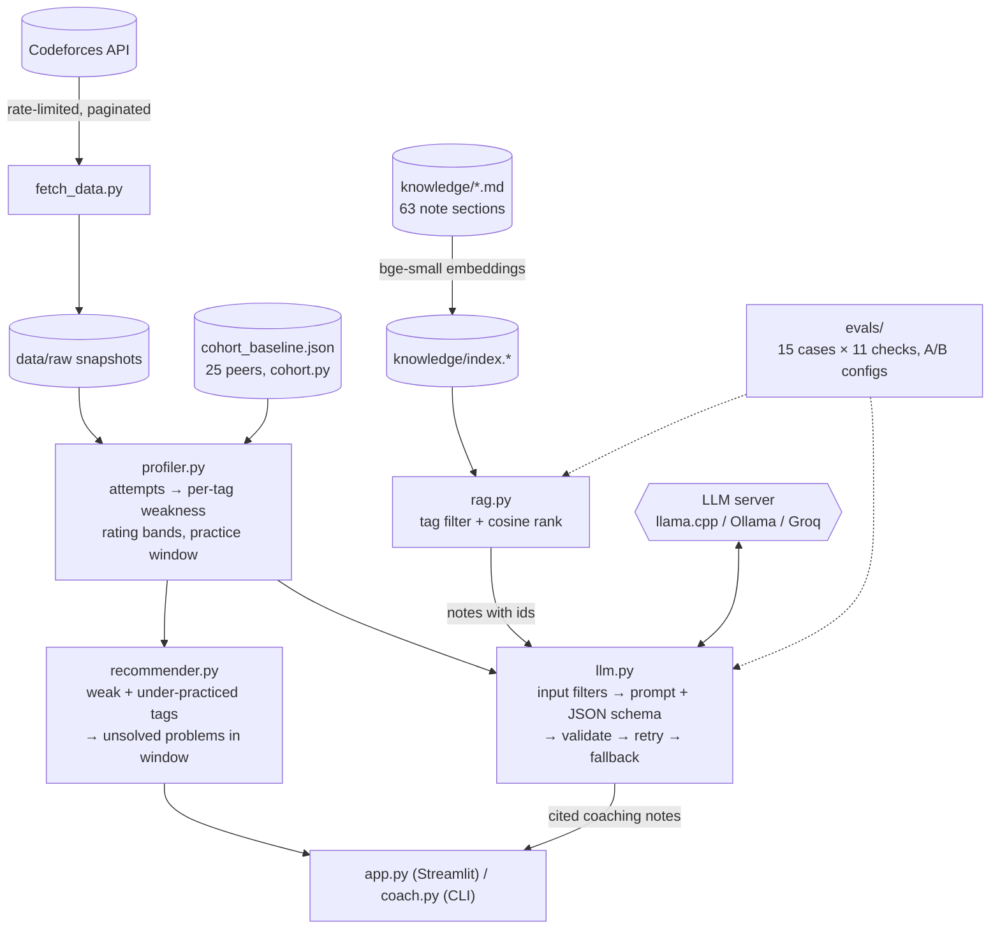

# cf-weakness-trainer

CF Practice Coach: pulls a user's Codeforces submission history, profiles their weak tags and rating bands from verdict patterns, and recommends targeted problems.

## How it works




- **Attempt:** one row per problem. Wrong submits are counted only before the first AC; compilation
  errors are ignored.
- **Weakness score:** `difficulty = (1 - solve rate) + 0.15 * wrong submits per problem`, and
  `weakness = difficulty(you) - difficulty(reference)`. The reference is the cohort's average for that
  tag (or your own overall average without a baseline). Small samples are smoothed with 3
  pseudo-attempts at the reference rate. A tag needs at least 3 attempts and weakness >= 0.05.
- **Under-practiced tag:** its share of your problems is less than half its share among problems in
  your practice window.
- **Practice window:** `max(current rating, median rating of your last 30 solves)`, rounded down to
  100, then +100 to +300.
- **Ordering:** problems you tried and failed come first, then a rating ladder (most-solved problem at
  each rating), with focus tags taking turns.
- **RAG:** `knowledge/` holds 19 technique notes split into one-idea sections (55–110 words), with a
  title path prepended before embedding (`BAAI/bge-small-en-v1.5`, via fastembed on CPU). Retrieval
  is hybrid: filter to notes tagged with the focus tag, then rank by cosine similarity (mistakes for
  weak tags, basics for under-practiced). Pure dense search couldn't tell "no relevant note" from a
  relevant one, see `evals/RETRIEVAL.md`.
- **LLM notes:** only aggregate stats are sent, plus the retrieved notes. Each hint cites the note it
  used. Where the server supports it (llama.cpp), a per-request JSON schema constrains decoding
  (exact tags, allowed note ids, diagnoses forced to start with the profile's numbers). Every reply
  is also validated in code (pydantic, exact tags, no duplicates, valid citations, numbers present),
  retried once with the error, then replaced by a rule-based summary.
- **Safety:** handle regex, tag allowlist, retrieved notes with instruction-like text dropped, data in
  delimited blocks, no tools, API key only from the environment and never logged.
- **Evals:** `python -m evals.run_evals` runs 15 fixed cases (including prompt injection through a
  tag name and through a poisoned note) and 11 checks, and compares configurations in
  `evals/RESULTS.md`.

## Run with Docker

```bash
docker build -t cf-coach .
docker run --rm -p 8501:8501 cf-coach                          # rule-based notes + RAG hints
docker run --rm -p 8501:8501 -e GROQ_API_KEY=... cf-coach      # hosted model
# a model server on the host (llama.cpp on :8080):
docker run --rm -p 8501:8501 --add-host=host.docker.internal:host-gateway \
  -e LLM_PROVIDER=llamacpp -e LLM_BASE_URL=http://host.docker.internal:8080/v1 cf-coach
```

The image runs as a non-root user, installs dependencies in their own cached layer, includes the
embedding model (no download at first request) and has a healthcheck on `/_stcore/health`.
If `pip install` can't resolve hosts during the build (a common Docker DNS issue on some Linux
hosts), build with `docker build --network host -t cf-coach .`.

## Design decisions

| Decision | Why |
|---|---|
| Streamlit calls Python functions directly (no API server) | one process, one language; `coach.analyze()` is pure, so an API can wrap it later |
| Smoothed weakness vs a peer cohort | small samples don't produce extreme rates; tags hard for everyone aren't flagged |
| Seeded random cohort, not standings order | standings order picked alt accounts (selection bias), see `NOTES.md` |
| The LLM only explains computed numbers | facts come from code; the model can't invent statistics or problems |
| Hybrid retrieval (tag filter + embeddings) | dense-only couldn't detect "no relevant note" (`evals/RETRIEVAL.md`) |
| JSON-schema constrained decoding + validation | valid output 15/30 → 30/30 on a 1.5B model (`evals/RESULTS.md`) |
| Input filters for tags and retrieved notes | without them the model followed a poisoned note 1 time in 3 |
| Local model support (llama.cpp) | data stays on the machine; no API key needed |

## Setup

```bash
python -m venv .venv && source .venv/bin/activate
pip install -r requirements-dev.txt
```

## Usage

```bash
python coach.py <handle>          # CLI report
streamlit run app.py              # web UI on http://localhost:8501
python cohort.py                  # rebuild cohort_baseline.json (~10 minutes, rate-limited)
pytest                            # tests use fake data, no network
```

Optional LLM notes (any OpenAI-compatible endpoint):

```bash
export GROQ_API_KEY=...                 # hosted, free tier: https://console.groq.com
# or fully local with llama.cpp (CPU, ~1.1 GB model; what the evals used):
#   download llama-<build>-bin-ubuntu-x64.tar.gz from github.com/ggml-org/llama.cpp/releases and
#   qwen2.5-1.5b-instruct-q4_k_m.gguf from huggingface.co/Qwen/Qwen2.5-1.5B-Instruct-GGUF, then
#   llama-server -m qwen2.5-1.5b-instruct-q4_k_m.gguf --port 8080 -c 8192
export LLM_PROVIDER=llamacpp
# or Ollama:  export LLM_PROVIDER=ollama
export LLM_MODEL=...                    # optional model override
```

RAG and evals:

```bash
python rag.py                           # rebuild knowledge/index.* after editing knowledge/*.md
python -m evals.retrieval_eval          # dense vs hybrid retrieval -> evals/RETRIEVAL.md
LLM_PROVIDER=llamacpp python -m evals.run_evals --repeat 2      # -> evals/RESULTS.md
python -m evals.run_evals --no-schema | --no-facts | --no-rag | --no-filters   # A/B configs
```

## Files

| File | Role |
|---|---|
| `fetch_data.py` | Rate-limited (2.2 s) Codeforces API client, pagination, raw snapshots |
| `snapshots.py` | Find and load the newest snapshot |
| `profiler.py` | Attempts, per-tag profile, rating bands, practice window, cohort baseline |
| `recommender.py` | Problem pool, under-practiced tags, recommendations |
| `coach.py` | End-to-end pipeline + CLI, handle validation, snapshot caching |
| `cohort.py` | Builds the ~25-user cohort and `cohort_baseline.json` |
| `rag.py` | Chunking, embeddings, vector store, tag-filtered retrieval, injection filter |
| `knowledge/` | CP technique notes (RAG source) and the committed index |
| `llm.py` | Prompt, notes, JSON schema, validation/retry/fallback, OpenAI-compatible client |
| `evals/` | Eval cases, checks, runner, results; retrieval eval |
| `app.py` | Streamlit UI |
| `audit.py` | Early exploratory script |

## TODO

Done:
- [x] `fetch_data.py`: paginated `user.status`, `user.rating`, `problemset.problems`, 2.2s rate limiter, raw JSON snapshots in `data/raw/`
- [x] `audit.py`: exploratory pandas on own submissions (verdict counts, `json_normalize`, dedupe problems, count missing ratings)
- [x] Cohort rule written down in `NOTES.md`

Cleanup:
- [x] `fetch_data.py`: handle passed as an argument instead of `HANDLE = input(...)` at module scope (importing it no longer blocks on a prompt)
- [x] `audit.py`: wrapped in a function, no hardcoded snapshot path in `data/raw/`
- [x] Skip rule settled: **or** (skip if < 5 contests or < 50 solved); sampling changed to a seeded shuffle, see `NOTES.md`
- [x] `requirements.txt` trimmed to direct dependencies (or marked as a full freeze)

Core recommender:
- [x] Cohort: 3 most recent Div. 2 contests → rating 800–1600 → seeded shuffle → first 25 handles passing the skip rule
- [x] Cohort data fetched and snapshotted
- [x] Weakness profiler: per-tag and per-rating-band solve rate / attempts-before-AC from verdicts
- [x] Recommender: unsolved problems in weak tags at a rating just above the comfort band
- [x] Tests for the profiler and recommender (small fake API data built in `tests/factories.py`)

UI and deploy:
- [x] Streamlit app that calls the Python functions directly (no FastAPI in v1)
- [ ] Un-containerized deploy (e.g. Streamlit Community Cloud)

LLM layer:
- [x] Open-source model explains weak tags and gives hints (verified with Qwen2.5-1.5B-Instruct via llama.cpp; Groq/Ollama configs untested)
- [x] Structured JSON output with schema validation and retry on bad JSON
- [x] No secrets or user data in logs

RAG (cut if not working):
- [x] CP notes chunked, embedded and stored in a vector store (own notes in `knowledge/`; CPH not copied for copyright reasons)
- [x] Retrieved chunks fed into the hint prompt with citations; chunk size and model choice written down with reasons

Evals:
- [x] 15 eval cases × 11 checks against a real model (`evals/RESULTS.md`)
- [x] Two prompt-injection cases (tag name, poisoned note)

Ship:
- [x] Dockerfile (non-root, healthcheck; built and run end to end locally)
- [x] README: setup, usage, architecture diagram (Mermaid), design decisions
- [ ] Resume updated with only what actually works

Stretch (not before the interview):
- [ ] Agent loop: LLM calling tools such as fetch-user-stats and search-problems
